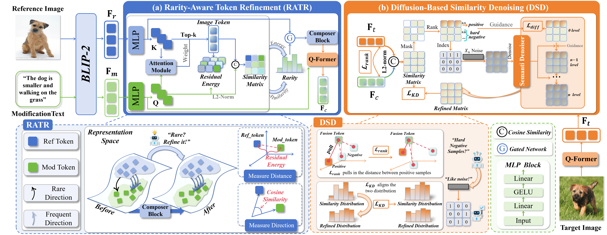
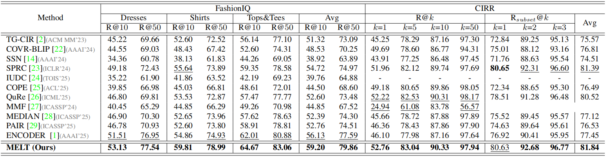

<a id="top"></a>
<div align="center">
  <h1>MELT: Improve Composed Image Retrieval via the <br> Modification Frequentation-Rarity Balance Network</h1>

  <div>
    <a target="_blank" href="https://lee-zixu.github.io/">Guozhi&#160;Qiu</a><sup>1</sup>,
    <a target="_blank" href="https://zivchen-ty.github.io/">Zhiwei&#160;Chen</a><sup>1</sup>,
    <a target="_blank" href="https://lee-zixu.github.io/">Zixu&#160;Li</a><sup>1</sup>,
    <a target="_blank" href="https://windlikeo.github.io/HQL.github.io/">Qinlei&#160;Huang</a><sup>1</sup>,
    <a target="_blank" href="https://zhihfu.github.io/">Zhiheng&#160;Fu</a><sup>1</sup>,
    <a target="_blank" href="#">Xuemeng&#160;Song</a><sup>2</sup>,
    <a target="_blank" href="https://faculty.sdu.edu.cn/huyupeng1/zh_CN/index.htm">Yupeng&#160;Hu</a><sup>1&#9993</sup>
  </div>
  <sup>1</sup>School of Software, Shandong University &#160;&#160;&#160</span>
  <sup>2</sup>Southern University of Science and Technology &#160;&#160;&#160</span>
  <br />
  <sup>&#9993&#160;</sup>Corresponding author&#160;&#160;</span>
  <br/>

  <p>
      <a href="#"></a>
      <a href="#"></a>
      <a href="#"></a>
      <a href="https://pytorch.org/"></a>
      
      
      <a href="https://github.com/luckylittlezhi/MELT"></a>
      
  </p>

  <p>
    <b>Accepted by ICASSP 2026:</b> A robust Composed Image Retrieval (CIR) paradigm tackling the fundamental bottlenecks of <b>Rare Sample Neglect</b> and <b>Similarity Matrix Distortion</b>.
  </p>
</div>
<br>

## 📑 Table of Contents


- [Motivation & Abstract](#motivation)
- [Core Highlights](#highlights)
- [Method Overview](#method)
- [Benchmark Performance](#benchmark)
- [Environment Setup](#setup)
- [Execution & Usage](#usage)
- [Codebase Navigator](#navigator)
- [Contact & Citation](#contact)
- [License](#license)


---

## 📢 Latest Updates
- **[2026-03-27]** ⏳ The full codebase and pre-trained checkpoints will be officially released by **April 15, 2026**. Stay tuned!
- **[2026-01-16]** 🎉 Our paper has been accepted by **ICASSP 2026**!

---

## <a id="motivation"></a>💡 Motivation & Abstract

Current Composed Image Retrieval (CIR) methodologies heavily suffer from an inherent **Frequency-Rarity Dilemma**. 

1. **The "Rare Sample Neglect" Trap**: Deep models are overwhelmingly dominated by high-frequency semantic patterns during training. Consequently, subtle yet critical *rare modification semantics* are marginalized or completely ignored.
2. **The "Hard-Negative" Interference**: In open-domain retrieval, the similarity matrix is highly susceptible to topological noise caused by hard-negative samples, directly leading to severe ranking degradation.

To break through these bottlenecks, we introduce **MELT**. By conceptualizing semantic retrieval as a balanced refinement process, MELT dynamically recalibrates the attention given to rare semantics and employs a diffusion-driven mechanism to purify the retrieval space.

---

[⬆ Back to top](#top)

## <a id="highlights"></a>💫 Core Highlights

* ⚖️ **Rarity-Aware Token Refinement (RATR)**: Instead of treating all text tokens equally, RATR utilizes text-guided cross-attention to pinpoint modification-relevant visual regions. It quantifies a *rarity score* via residual energy evaluation, adaptively amplifying the signal of neglected rare semantics.
* 🌪️ **Diffusion-Based Similarity Denoising (DSD)**: Innovatively models hard-negative interference as "noise" on the similarity matrix. DSD introduces a lightweight, DDIM-driven continuous denoising process to progressively distill authentic semantic correlations.
* 🏆 **State-of-the-Art Boundaries**: Establishes new SOTA benchmarks across both fashion-specific (FashionIQ) and open-world (CIRR) domains.
* 🔌 **Seamless Integration**: Elegantly built upon the powerful BLIP-2/LAVIS architecture, ensuring robust baseline performance and easy extensibility.

---
[⬆ Back to top](#top)

## <a id="method"></a>📐 Method Overview

<div align="center">
  
  <p><em><b>Figure 1.</b> The pipeline of MELT. The RATR module focuses on fine-grained semantic recalibration, while the DSD module ensures a robust, noise-free retrieval ranking.</em></p>
</div>

---
[⬆ Back to top](#top)

## <a id="benchmark"></a>📈 Benchmark Performance


Extensive quantitative evaluations demonstrate the superiority of MELT against recent SOTA methods.

### Overall Performance


> *Performance relative to Recall@K (%). **Bold** indicates the overall best, and <u>underline</u> denotes the second best. For CIRR, the Avg metric represents (R@5 + R_subset@1) / 2.*
---
[⬆ Back to top](#top)

## <a id="setup"></a>⚙️ Environment Setup

### 1. Dependencies Installation

**Clone the repository:**
```bash
git clone [https://github.com/luckylittlezhi/MELT.git](https://github.com/luckylittlezhi/MELT.git)
cd MELT
```

**Build the Environment:**
We recommend using `conda` for isolated dependency management. The following setup is evaluated on **Python 3.8.10** and **CUDA 12.6**.

```bash
conda create -n melt python=3.9 -y
conda activate melt

# Install PyTorch (Please match the CUDA version with your local hardware)
pip install torch torchvision --index-url [https://download.pytorch.org/whl/cu118](https://download.pytorch.org/whl/cu118)

# Install foundational vision-language dependencies
pip install salesforce-lavis transformers timm Pillow
```

[⬆ Back to top](#top)

### 2. Dataset Preparation

Download the standard benchmarks [FashionIQ](https://github.com/XiaoxiaoGuo/fashion-iq) and [CIRR](https://github.com/Cuberick-Orion/CIRR). Ensure your data hierarchy aligns with the following structure:

<details>
<summary><b>📂 Click to expand: FashionIQ Structure</b></summary>

```text
├── FashionIQ
│   ├── captions
│   │   ├── cap.dress.[train | val | test].json
│   │   ├── cap.toptee.[train | val | test].json
│   │   ├── cap.shirt.[train | val | test].json
│   ├── image_splits
│   │   ├── split.dress.[train | val | test].json
│   │   ├── split.toptee.[train | val | test].json
│   │   ├── split.shirt.[train | val | test].json
│   ├── dress
│   ├── shirt
│   ├── toptee
```
</details>

<details>
<summary><b>📂 Click to expand: CIRR Structure</b></summary>

```text
├── CIRR
│   ├── train
│   ├── dev
│   ├── test1
│   ├── cirr
│   ├── captions
│   │   ├── cap.rc2.[train | val | test1].json
│   ├── image_splits
│   │   ├── split.rc2.[train | val | test1].json
```
</details>

---
[⬆ Back to top](#top)

## <a id="usage"></a>🚀 Execution & Usage

### 1. Model Training

> **💡 Hardware Note:** Given the BLIP-2 backbone, training requires sufficient VRAM. We recommend NVIDIA A40 (48GB) or V100 (32GB) GPUs. Model checkpoints and validation metrics will be continuously updated in the specified `--model_dir`.

**Train on FashionIQ:**
```bash
python train.py \
    --dataset fashioniq \
    --fashioniq_path "/path/to/FashionIQ/" \
    --model_dir "/path/to/melt_model" \
    --batch_size 128 \
    --num_epochs 20 \
    --lr 1e-5
```

**Train on CIRR:**
```bash
python train.py \
    --dataset cirr \
    --cirr_path "/path/to/CIRR/" \
    --model_dir "/path/to/melt_model" \
    --batch_size 128 \
    --num_epochs 20 \
    --lr 1e-5
```

### 2. Evaluation & Testing

For the CIRR dataset, an explicit submission file is required for the [CIRR Evaluation Server](https://cirr.cecs.anu.edu.au/). Use the following script to generate the `.json` prediction:

```bash
python cirr_sub_BLIP2.py /path/to/melt_model/
```

---
[⬆ Back to top](#top)

## <a id="navigator"></a>🗺️ Codebase Navigator

Our architecture extends the [LAVIS](https://github.com/salesforce/LAVIS) library. Key structural files are detailed below:

```text
MELT/
├── lavis/
│   ├── models/
│   │   └── blip2_models/
│   │       └── melt_models.py      # 🧠 Core engine: Implementation of RATR & DSD modules
├── train.py                        # 🚀 Main entry: Configures hyperparameters & training loop
├── datasets.py                     # 📦 Data wrappers
├── test_BLIP2.py                         # 🧪 Local validation tools
├── test_cirr_fiq.py                      # 🧪 Local validation script
├── utils.py                        
├── data_utils.py                   
├── cirr_sub.py               # 📝 Sub-routine: Generates CIRR online evaluation format
├── datasets/                       # 📁 Offline dataset loading configurations
└── README.md
```

---
[⬆ Back to top](#top)

## 🤝 Acknowledgement

This codebase significantly benefits from the robust infrastructure provided by [LAVIS](https://github.com/salesforce/LAVIS). We extend our deepest gratitude to the open-source community for their invaluable contributions.

---

## <a id="contact"></a>🖋️ Contact & Citation

If you encounter any issues or have questions about the implementation, please feel free to open an [issue](https://github.com/luckylittlezhi/MELT/issues) or reach out directly at `gzqiu007@gmail.com`.

If you find MELT insightful or utilize our code in your research, we would greatly appreciate a **Star 🌟** and a citation:

```bibtex
@article{qiu2026melt,
  title={MELT: Improve Composed Image Retrieval via the Modification Frequentation-Rarity Balance Network},
  author={Qiu, Guozhi and Chen, Zhiwei and Li, Zixu and Huang, Qinlei and Fu, Zhiheng and Song, Xuemeng and Hu, Yupeng},
  journal={arXiv preprint arXiv:2603.29291},
  year={2026}
}
```

[⬆ Back to top](#top)


## <a id="license"></a>📄 License

This project is licensed under the **MIT License** – see the [LICENSE](sslocal://flow/file_open?url=LICENSE&flow_extra=eyJsaW5rX3R5cGUiOiJjb2RlX2ludGVycHJldGVyIn0=) file for details.

[⬆ Back to top](sslocal://flow/file_open?url=%23top&flow_extra=eyJsaW5rX3R5cGUiOiJjb2RlX2ludGVycHJldGVyIn0=)

---
